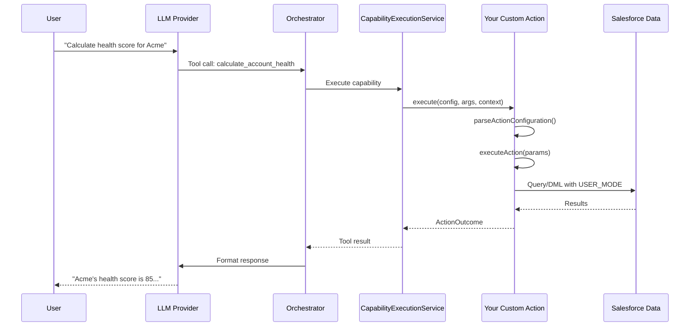
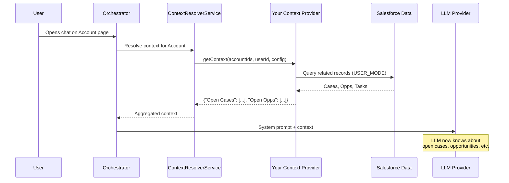
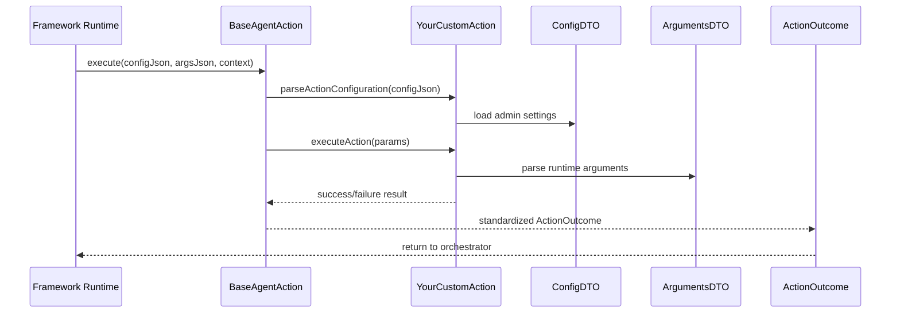
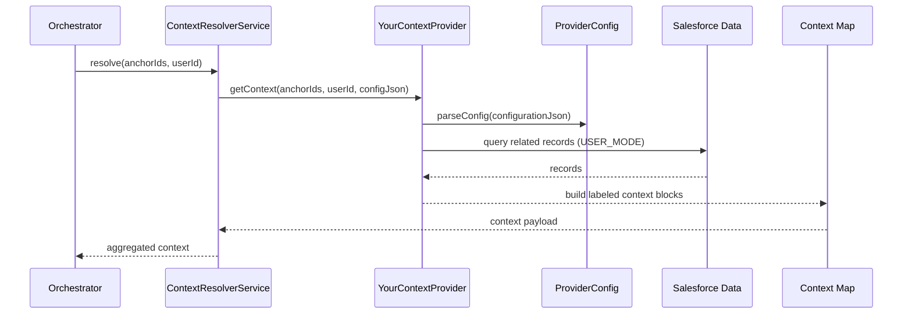
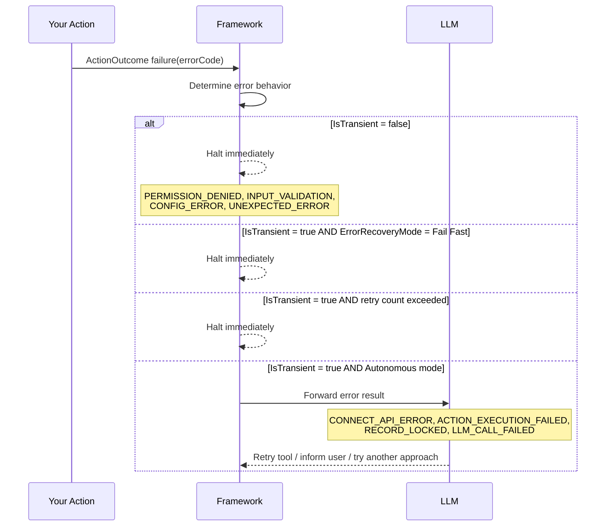

import { Aside, Badge, Card, CardGrid, FileTree, LinkButton, LinkCard, Steps } from '@astrojs/starlight/components';

# Developer Guide

Build custom actions and context providers to extend the AI Agent Framework.

<p><Badge text="Developer" variant="tip" size="small" /> <Badge text="Advanced" variant="caution" size="small" /></p>

<Aside type="tip" title="Implementation Flow">
Start with a minimal custom action, validate with tests, then expand behavior and context providers incrementally.
</Aside>

## Suggested Workspace Paths

<FileTree>
- `force-app/`
  - `main/default/classes/`
    - `BaseAgentAction.cls`
    - `IAgentAction.cls`
    - `...custom actions...`
- `seed-data/`
  - `main/default/classes/`
    - `...reference examples...`
</FileTree>

<LinkButton href="../getting-started/" variant="secondary">Setup Prerequisites</LinkButton>
<LinkButton href="../../reference/actions/" icon="right-arrow">Action Reference</LinkButton>


## Overview

<CardGrid>
  <Card title="Custom Actions" icon="seti:gear">
    Extend agent capabilities with custom business logic. Implement `IAgentAction` (extend `BaseAgentAction`) to give agents new tools — external API calls, multi-object operations, calculations, or anything Apex can do.
  </Card>
  <Card title="Context Providers" icon="seti:db">
    Supply dynamic data to agents before each conversation turn. Implement `IAgentContextProvider` to automatically inject related records, user context, or aggregated data into the system prompt.
  </Card>
</CardGrid>

Both extension points follow consistent patterns for security, error handling, and integration with the framework.

### How Custom Actions Fit in the Framework



### How Context Providers Fit in the Framework



---

## Custom Actions

Custom actions allow agents to perform operations beyond the standard CRUD actions. Use them for complex business logic, external integrations, or specialized workflows.

### When to Create a Custom Action

<CardGrid>
  <Card title="Complex Business Logic" icon="seti:apex">
    Operations spanning multiple objects, custom validation, or transformation logic that exceeds what standard actions provide.
  </Card>
  <Card title="External Integrations" icon="seti:cloud">
    Callouts to external APIs, webhooks, or third-party services that the agent needs to interact with.
  </Card>
  <Card title="Specialized Processing" icon="seti:gear">
    Custom calculations, scoring models, data enrichment, or workflow decisions that require Apex code.
  </Card>
  <Card title="Transaction Control" icon="seti:config">
    Operations needing specific DML ordering, async dispatch, or platform event publishing.
  </Card>
</CardGrid>

### Architecture Overview



### Step-by-Step Implementation

#### Step 1: Create the Apex Class

```apex
/**
 * @description
 * Custom action to calculate account health score based on multiple factors.
 * Demonstrates best practices for custom action implementation.
 */
public class ActionCalculateAccountHealth extends BaseAgentAction {

    private ConfigDTO config;

    /**
     * DTO for admin-configured settings (Backend Configuration)
     * These values are set by admins when creating the capability
     */
    public class ConfigDTO {
        public Decimal revenueWeight;
        public Decimal engagementWeight;
        public Decimal supportWeight;
        public String scoringModel; // 'standard' or 'enterprise'
    }

    /**
     * DTO for AI-provided parameters at runtime
     * These are passed by the LLM when invoking the action
     */
    public class ArgumentsDTO {
        public Id accountId;
        public Boolean includeHistory;
        public Integer lookbackDays;
    }

    /**
     * Main execution method - implement your business logic here
     */
    public override ActionOutcome executeAction(Map<String, Object> params) {
        // 1. Deserialize parameters into DTO
        ArgumentsDTO args = new ArgumentsDTO();
        args.accountId = (Id) params.get('accountId');
        args.includeHistory = params.containsKey('includeHistory')
            ? (Boolean) params.get('includeHistory')
            : false;
        args.lookbackDays = params.containsKey('lookbackDays')
            ? Integer.valueOf(params.get('lookbackDays'))
            : 90;

        // 2. Validate required parameters
        if (args.accountId == null) {
            return ActionOutcome.failure(
                AIAgentConstants.ERR_CODE_INPUT_VALIDATION,
                'accountId is required'
            );
        }

        // 3. Check object-level permissions
        try {
            Utils.checkObjectPermission(
                Account.SObjectType,
                AccessType.READABLE
            );
        } catch (Utils.ActionSecurityException e) {
            return ActionOutcome.failure(
                AIAgentConstants.ERR_CODE_PERMISSION_DENIED,
                e.getMessage()
            );
        }

        // 4. Execute business logic
        try {
            HealthScoreResult result = calculateHealthScore(args);
            return ActionOutcome.success(result);
        } catch (Exception e) {
            System.debug(LoggingLevel.ERROR,
                '[ActionCalculateAccountHealth] Error: ' + e.getMessage());
            // fromException() classifies the exception type automatically —
            // no need to specify an error code or worry about transience.
            return ActionOutcome.fromException(e);
        }
    }

    /**
     * Parse admin configuration - called before executeAction
     */
    @TestVisible
    protected override void parseActionConfiguration(
        String actionConfigurationJson,
        String logPrefix
    ) {
        this.config = new ConfigDTO();

        if (String.isNotBlank(actionConfigurationJson)) {
            Map<String, Object> configMap = (Map<String, Object>)
                JSON.deserializeUntyped(actionConfigurationJson);

            this.config.revenueWeight = configMap.containsKey('revenueWeight')
                ? (Decimal) configMap.get('revenueWeight')
                : 0.4;
            this.config.engagementWeight = configMap.containsKey('engagementWeight')
                ? (Decimal) configMap.get('engagementWeight')
                : 0.3;
            this.config.supportWeight = configMap.containsKey('supportWeight')
                ? (Decimal) configMap.get('supportWeight')
                : 0.3;
            this.config.scoringModel = (String) configMap.get('scoringModel');
        } else {
            // Set defaults
            this.config.revenueWeight = 0.4;
            this.config.engagementWeight = 0.3;
            this.config.supportWeight = 0.3;
            this.config.scoringModel = 'standard';
        }
    }

    private HealthScoreResult calculateHealthScore(ArgumentsDTO args) {
        // Your business logic here
        Account acc = [
            SELECT Id, Name, AnnualRevenue, NumberOfEmployees
            FROM Account
            WHERE Id = :args.accountId
            WITH USER_MODE
            LIMIT 1
        ];

        // Calculate score based on config weights
        Decimal score = 75.0; // Simplified example

        return new HealthScoreResult(
            acc.Id,
            score,
            'Account health score calculated successfully'
        );
    }

    /**
     * Result wrapper - provides structured data for LLM consumption
     */
    public class HealthScoreResult {
        public String accountId;
        public Decimal healthScore;
        public String message;
        public Map<String, Object> metadata;

        public HealthScoreResult(Id accId, Decimal score, String msg) {
            this.accountId = String.valueOf(accId);
            this.healthScore = score;
            this.message = msg;
            this.metadata = new Map<String, Object>{
                'accountId' => accId,
                'score' => score,
                'calculatedAt' => System.now()
            };
        }
    }
}
```

#### Step 2: Create the Capability Record

In Salesforce, create an `AgentCapability__c` record:

| Field | Value |
|:------|:------|
| Capability Name | `calculate_account_health` |
| Description | Calculates a health score for an account based on revenue, engagement, and support metrics. Use when the user asks about account health, risk assessment, or customer scoring. |
| Implementation Type | `Apex` |
| Implementation Detail | `ActionCalculateAccountHealth` |
| AI Agent Definition | (Your agent) |
| Backend Configuration | `{"revenueWeight": 0.4, "engagementWeight": 0.3, "supportWeight": 0.3, "scoringModel": "standard"}` |
| Parameters | See JSON Schema below |

**Parameters JSON Schema:**
```json
{
  "type": "object",
  "required": ["accountId"],
  "properties": {
    "accountId": {
      "type": "string",
      "description": "The 18-character Salesforce Account ID"
    },
    "includeHistory": {
      "type": "boolean",
      "description": "Include historical trend data in the response"
    },
    "lookbackDays": {
      "type": "integer",
      "description": "Number of days to analyze (default: 90)"
    }
  }
}
```

### Best Practices for Custom Actions

#### Security

```apex
// ✅ DO: Always check object permissions
Utils.checkObjectPermission(Account.SObjectType, AccessType.READABLE);

// ✅ DO: Use WITH USER_MODE in SOQL
List<Account> accounts = [SELECT Id FROM Account WITH USER_MODE];

// ✅ DO: Use Security.stripInaccessible for DML
SObjectAccessDecision decision = Security.stripInaccessible(
    AccessType.CREATABLE,
    recordsToInsert
);
insert decision.getRecords();

// ❌ DON'T: Query without security enforcement
List<Account> accounts = [SELECT Id FROM Account]; // Missing USER_MODE
```

#### Error Handling

The framework uses `ActionOutcome` as the return type for all success and failure states. Error handling is built around two key concepts: **error codes** that drive machine-readable retry decisions, and **transience** that determines whether the LLM gets a chance to recover.

**In catch blocks — always use `fromException()`:**

```apex
// ✅ DO: Let the framework classify the exception type for you
} catch (Exception e) {
    return ActionOutcome.fromException(e);
}

// ✅ DO: Add domain-specific guidance when you have context to share
} catch (Exception e) {
    return ActionOutcome.fromException(e, 'Verify the queue developer name exists in this org');
}

// ❌ DON'T: Default to UNEXPECTED_ERROR — it is non-transient and the LLM will
//           never see the error. The correct code is determined by exception type.
} catch (Exception e) {
    return ActionOutcome.failure(AIAgentConstants.ERR_CODE_UNEXPECTED_ERROR, e.getMessage());
}
```

**For business-logic failures (no exception thrown):**

```apex
// ✅ DO: Use explicit error codes for non-exception failures
if (records.isEmpty()) {
    return ActionOutcome.failure(
        AIAgentConstants.ERR_CODE_RECORD_NOT_FOUND,
        'No records found matching: ' + searchTerm
    );
}

// Validation failures
if (String.isBlank(args.accountId)) {
    return ActionOutcome.failure(
        AIAgentConstants.ERR_CODE_INPUT_VALIDATION,
        'accountId is required'
    );
}

// HTTP error responses
if (res.getStatusCode() >= 400) {
    return ActionOutcome.failure(
        AIAgentConstants.ERR_CODE_CONNECT_API_ERROR,
        'HTTP ' + res.getStatusCode() + ': ' + res.getStatus()
    );
}

// Add correction guidance when it helps the LLM fix the problem
return ActionOutcome.failure(
    AIAgentConstants.ERR_CODE_INPUT_VALIDATION,
    'Invalid date format provided',
    'Expected format: YYYY-MM-DD. Example: 2024-03-15'
);
```

**How error codes affect framework behavior:**

| Error code | Transient? | What happens |
|:-----------|:----------:|:-------------|
| `CONNECT_API_ERROR` | Yes | LLM receives the error and may retry |
| `ACTION_EXECUTION_FAILED` | Yes | LLM receives the error and may retry |
| `RECORD_LOCKED` | Yes | LLM receives the error and may retry |
| `LLM_CALL_FAILED` | Yes | LLM receives the error and may retry |
| `INPUT_VALIDATION` | No | Framework halts immediately — retrying won't fix bad input |
| `PERMISSION_DENIED` | No | Framework halts immediately |
| `CONFIG_ERROR` | No | Framework halts immediately |
| `UNEXPECTED_ERROR` | No | Framework halts immediately |

**How `fromException()` classifies by type:**

| Exception type | Mapped error code |
|:---------------|:-----------------|
| `System.CalloutException` | `CONNECT_API_ERROR` (transient) |
| `System.MathException`, `NullPointerException`, `ListException` | `ACTION_EXECUTION_FAILED` (transient) |
| `System.TypeException`, `JSONException`, `StringException` | `INPUT_VALIDATION` |
| `System.NoAccessException`, `SecurityException` | `PERMISSION_DENIED` |
| `System.SObjectException` | `CONFIG_ERROR` |
| `System.LimitException` | `SYSTEM_LIMIT_EXCEEDED` |
| `System.QueryException` | `SOQL_ERROR` |
| `DmlException` | `DML_ERROR` |
| Everything else | `UNEXPECTED_ERROR` |

<Aside type="note" title="DML and Query Exceptions">
When `DmlException` or `QueryException` bubble up through the framework without being caught in your action code, `BaseAgentAction` performs deeper inspection — e.g., `UNABLE_TO_LOCK_ROW` maps to `RECORD_LOCKED` (transient), and queries failing due to `security enforced` map to `PERMISSION_DENIED`. If you catch these yourself and call `fromException()`, you get the base code without that inspection.
</Aside>

#### Parameter Handling

```apex
// ✅ DO: Handle optional parameters with defaults
args.lookbackDays = params.containsKey('lookbackDays')
    ? Integer.valueOf(params.get('lookbackDays'))
    : 90;

// ✅ DO: Validate required parameters early
if (args.accountId == null) {
    return ActionOutcome.failure(
        AIAgentConstants.ERR_CODE_INPUT_VALIDATION,
        'accountId is required'
    );
}

// ✅ DO: Use TypeCoercionService for SObject field coercion
Map<String, Object> typedData = TypeCoercionService.coerceArgumentTypesForSObject(
    fieldData,
    Account.SObjectType,
    AccessType.CREATABLE
);
```

#### Result Structure

```apex
// ✅ DO: Include a 'message' field for user display
public class MyResult {
    public String message;  // Framework uses this for display
    public Object data;
    public Map<String, Object> metadata;
}

// ✅ DO: Provide rich metadata for LLM context
this.metadata = new Map<String, Object>{
    'recordId' => recordId,
    'operationType' => 'create',
    'fieldsModified' => fieldList,
    'timestamp' => System.now()
};
```


---

## Agent Context Providers

Context providers supply dynamic, relevant data to agents during conversations. They enable agents to understand the current business context without explicit user queries.

### When to Create a Context Provider

<CardGrid>
  <Card title="Related Records" icon="seti:db">
    Automatically inject open cases, opportunities, or activities for the record the user is viewing — no explicit query needed.
  </Card>
  <Card title="User Context" icon="seti:settings">
    Supply the agent with the current user's team, territory, preferences, or role-specific data.
  </Card>
  <Card title="Aggregated Data" icon="seti:graph-line">
    Combine data from multiple sources or objects into labeled context blocks the LLM can reason over.
  </Card>
  <Card title="Derived Context" icon="seti:config">
    Computed values, business-specific filters, or enriched data that the LLM should always have available.
  </Card>
</CardGrid>

### Architecture Overview



### Step-by-Step Implementation

#### Step 1: Create the Apex Class

```apex
/**
 * @description
 * Provides open cases and recent activities for accounts being discussed.
 * Demonstrates best practices for context provider implementation.
 */
public class AccountContextProvider implements IAgentContextProvider {

    /**
     * Main entry point - returns context data for the given anchor records
     *
     * @param anchorIds Set of record IDs to gather context for
     * @param userId The current user's ID
     * @param configurationJson Optional JSON configuration
     * @return Map of context labels to lists of SObjects
     */
    public Map<String, List<SObject>> getContext(
        Set<Id> anchorIds,
        Id userId,
        String configurationJson
    ) {
        Map<String, List<SObject>> results = new Map<String, List<SObject>>();

        if (anchorIds == null || anchorIds.isEmpty()) {
            return results;
        }

        // Parse optional configuration
        ProviderConfig config = parseConfig(configurationJson);

        // Filter to only Account IDs (provider may receive mixed types)
        Set<Id> accountIds = filterToAccountIds(anchorIds);
        if (accountIds.isEmpty()) {
            return results;
        }

        // Gather open cases
        List<Case> openCases = queryOpenCases(accountIds, config.caseLimit);
        if (!openCases.isEmpty()) {
            results.put('Open Cases', openCases);
        }

        // Gather recent activities
        List<Task> recentTasks = queryRecentTasks(accountIds, config.activityDays);
        if (!recentTasks.isEmpty()) {
            results.put('Recent Activities', recentTasks);
        }

        // Gather open opportunities
        List<Opportunity> openOpps = queryOpenOpportunities(accountIds);
        if (!openOpps.isEmpty()) {
            results.put('Open Opportunities', openOpps);
        }

        System.debug(LoggingLevel.INFO,
            '[AccountContextProvider] Returned ' + results.size() +
            ' context blocks for ' + accountIds.size() + ' accounts');

        return results;
    }

    /**
     * Filter IDs to only Account IDs
     */
    private Set<Id> filterToAccountIds(Set<Id> allIds) {
        Set<Id> accountIds = new Set<Id>();
        for (Id recordId : allIds) {
            if (recordId.getSObjectType() == Account.SObjectType) {
                accountIds.add(recordId);
            }
        }
        return accountIds;
    }

    /**
     * Query open cases - always use WITH USER_MODE
     */
    private List<Case> queryOpenCases(Set<Id> accountIds, Integer limitCount) {
        return [
            SELECT Id, CaseNumber, Subject, Status, Priority, CreatedDate
            FROM Case
            WHERE AccountId IN :accountIds
              AND IsClosed = false
            WITH USER_MODE
            ORDER BY Priority DESC, CreatedDate DESC
            LIMIT :limitCount
        ];
    }

    /**
     * Query recent tasks
     */
    private List<Task> queryRecentTasks(Set<Id> accountIds, Integer daysBack) {
        Date cutoffDate = Date.today().addDays(-daysBack);
        return [
            SELECT Id, Subject, Status, ActivityDate, WhatId
            FROM Task
            WHERE WhatId IN :accountIds
              AND ActivityDate >= :cutoffDate
            WITH USER_MODE
            ORDER BY ActivityDate DESC
            LIMIT 10
        ];
    }

    /**
     * Query open opportunities
     */
    private List<Opportunity> queryOpenOpportunities(Set<Id> accountIds) {
        return [
            SELECT Id, Name, StageName, Amount, CloseDate
            FROM Opportunity
            WHERE AccountId IN :accountIds
              AND IsClosed = false
            WITH USER_MODE
            ORDER BY CloseDate ASC
            LIMIT 5
        ];
    }

    /**
     * Parse optional configuration JSON
     */
    private ProviderConfig parseConfig(String configJson) {
        ProviderConfig config = new ProviderConfig();

        if (String.isNotBlank(configJson)) {
            try {
                Map<String, Object> configMap = (Map<String, Object>)
                    JSON.deserializeUntyped(configJson);

                if (configMap.containsKey('caseLimit')) {
                    config.caseLimit = Integer.valueOf(configMap.get('caseLimit'));
                }
                if (configMap.containsKey('activityDays')) {
                    config.activityDays = Integer.valueOf(configMap.get('activityDays'));
                }
            } catch (Exception e) {
                System.debug(LoggingLevel.WARN,
                    '[AccountContextProvider] Failed to parse config: ' + e.getMessage());
            }
        }

        return config;
    }

    /**
     * Configuration holder with defaults
     */
    private class ProviderConfig {
        public Integer caseLimit = 10;
        public Integer activityDays = 30;
    }
}
```

#### Step 2: Create User-Centric Provider (No Record Context)

```apex
/**
 * @description
 * Provides user-specific context like team members, territory, and preferences.
 * This provider does NOT require a record context - it uses the user ID as anchor.
 */
public class UserContextProvider implements IAgentContextProvider {

    public Map<String, List<SObject>> getContext(
        Set<Id> anchorIds,
        Id userId,
        String configurationJson
    ) {
        Map<String, List<SObject>> results = new Map<String, List<SObject>>();

        // For user-centric providers, anchorIds contains the userId
        // We use the userId parameter directly

        // Get user details
        List<User> userDetails = [
            SELECT Id, Name, Email, Department, Title, ManagerId, Manager.Name
            FROM User
            WHERE Id = :userId
            WITH USER_MODE
            LIMIT 1
        ];

        if (!userDetails.isEmpty()) {
            results.put('Current User', userDetails);
        }

        // Get user's team (direct reports)
        List<User> teamMembers = [
            SELECT Id, Name, Email, Title
            FROM User
            WHERE ManagerId = :userId AND IsActive = true
            WITH USER_MODE
            LIMIT 20
        ];

        if (!teamMembers.isEmpty()) {
            results.put('Direct Reports', teamMembers);
        }

        return results;
    }
}
```

#### Step 3: Create the Configuration Record

Create an `AgentContextConfig__c` record:

| Field | Value |
|:------|:------|
| AI Agent Definition | (Your agent) |
| Implementation Type | `Apex` |
| Implementation Name | `AccountContextProvider` |
| Applicable SObject Types | `Account` |
| Requires Record Context | `true` |
| Is Active | `true` |
| Execution Order | `10` |
| Context Label | `Account Context` |
| Implementation Config JSON | `{"caseLimit": 10, "activityDays": 30}` |

For user-centric providers:

| Field | Value |
|:------|:------|
| Implementation Name | `UserContextProvider` |
| Requires Record Context | `false` |
| Applicable SObject Types | (leave blank) |

### Best Practices for Context Providers

#### Security

```apex
// ✅ DO: Always use WITH USER_MODE
List<Case> cases = [
    SELECT Id, Subject
    FROM Case
    WHERE AccountId IN :accountIds
    WITH USER_MODE  // Enforces FLS and sharing
];

// ✅ DO: Handle empty results gracefully
if (!cases.isEmpty()) {
    results.put('Open Cases', cases);
}
// Don't add empty lists to results

// ❌ DON'T: Query without security
List<Case> cases = [SELECT Id FROM Case]; // Missing USER_MODE!
```

#### Bulk Safety

```apex
// ✅ DO: Use Set<Id> for bulk-safe queries
public Map<String, List<SObject>> getContext(
    Set<Id> anchorIds,  // May contain multiple IDs
    Id userId,
    String configJson
) {
    // Single query handles all IDs
    List<Case> cases = [
        SELECT Id FROM Case
        WHERE AccountId IN :anchorIds  // Bulk-safe
        WITH USER_MODE
    ];
}

// ❌ DON'T: Query inside loops
for (Id accountId : anchorIds) {
    List<Case> cases = [SELECT Id FROM Case WHERE AccountId = :accountId];
    // This causes N+1 query problem!
}
```

#### Performance

```apex
// ✅ DO: Limit query results
LIMIT 10  // Always set reasonable limits

// ✅ DO: Select only needed fields
SELECT Id, CaseNumber, Subject, Status  // Specific fields
// Not: SELECT Id, ... (all fields)

// ✅ DO: Use indexed fields in WHERE clauses
WHERE AccountId IN :accountIds  // AccountId is indexed
  AND IsClosed = false
  AND CreatedDate >= :cutoffDate

// ✅ DO: Order results meaningfully for the agent
ORDER BY Priority DESC, CreatedDate DESC
```

#### Context Labels

```apex
// ✅ DO: Use descriptive, consistent labels
results.put('Open Cases', openCases);
results.put('Recent Activities', recentTasks);
results.put('Open Opportunities', openOpps);

// ✅ DO: Labels should describe the data clearly
// The LLM uses these labels to understand the context

// ❌ DON'T: Use generic or unclear labels
results.put('Data1', cases);  // Unclear
results.put('stuff', tasks);  // Unprofessional
```

---

## Testing Custom Actions

```apex
@IsTest
private class ActionCalculateAccountHealthTest {

    @TestSetup
    static void setup() {
        Account testAccount = new Account(
            Name = 'Test Account',
            AnnualRevenue = 1000000
        );
        insert testAccount;
    }

    @IsTest
    static void testSuccessfulExecution() {
        Account acc = [SELECT Id FROM Account LIMIT 1];

        ActionCalculateAccountHealth action = new ActionCalculateAccountHealth();

        // Create test context
        ActionContext ctx = new ActionContext(
            null,           // executionId
            UserInfo.getUserId(),  // originalUserId
            UserInfo.getUserId(),  // executionUserId
            acc.Id,         // relatedRecordId
            null,           // agentDefinitionId
            null,           // agentCapabilityId
            'ActionCalculateAccountHealth',  // implementationDetail
            'test-turn-1',  // turnIdentifier
            1,              // currentTurnCount
            'Conversational'  // executionType
        );

        // Execute with configuration
        String configJson = '{"revenueWeight": 0.5, "scoringModel": "standard"}';
        String argsJson = '{"accountId": "' + acc.Id + '", "includeHistory": true}';

        Test.startTest();
        ActionOutcome result = action.execute(configJson, argsJson, ctx);
        Test.stopTest();

        System.assert(result.isSuccess, 'Action should succeed');
        System.assertNotEquals(null, result.data, 'Should return data');
    }

    @IsTest
    static void testMissingRequiredParameter() {
        ActionCalculateAccountHealth action = new ActionCalculateAccountHealth();

        ActionContext ctx = new ActionContext(
            null, UserInfo.getUserId(), UserInfo.getUserId(),
            null, null, null, 'ActionCalculateAccountHealth',
            'test-turn-1', 1, 'Conversational'
        );

        // Missing accountId
        String argsJson = '{"includeHistory": true}';

        Test.startTest();
        ActionOutcome result = action.execute('{}', argsJson, ctx);
        Test.stopTest();

        System.assert(!result.isSuccess, 'Should fail without accountId');
        System.assertEquals(
            AIAgentConstants.ERR_CODE_INPUT_VALIDATION,
            result.errorCode
        );
    }
}
```

---

## Testing Context Providers

```apex
@IsTest
private class AccountContextProviderTest {

    @TestSetup
    static void setup() {
        Account testAccount = new Account(Name = 'Test Account');
        insert testAccount;

        Case testCase = new Case(
            AccountId = testAccount.Id,
            Subject = 'Test Case',
            Status = 'New'
        );
        insert testCase;
    }

    @IsTest
    static void testGetContext() {
        Account acc = [SELECT Id FROM Account LIMIT 1];

        AccountContextProvider provider = new AccountContextProvider();

        Test.startTest();
        Map<String, List<SObject>> context = provider.getContext(
            new Set<Id>{ acc.Id },
            UserInfo.getUserId(),
            '{"caseLimit": 5}'
        );
        Test.stopTest();

        System.assert(context.containsKey('Open Cases'),
            'Should return Open Cases context');
        System.assertEquals(1, context.get('Open Cases').size(),
            'Should return 1 case');
    }

    @IsTest
    static void testEmptyAnchorIds() {
        AccountContextProvider provider = new AccountContextProvider();

        Map<String, List<SObject>> context = provider.getContext(
            new Set<Id>(),
            UserInfo.getUserId(),
            null
        );

        System.assert(context.isEmpty(),
            'Should return empty map for empty anchor IDs');
    }
}
```

---

## Common Patterns

### External API Integration Action

```apex
public class ActionWeatherLookup extends BaseAgentAction {

    public override ActionOutcome executeAction(Map<String, Object> params) {
        String city = (String) params.get('city');

        if (String.isBlank(city)) {
            return ActionOutcome.failure(
                AIAgentConstants.ERR_CODE_INPUT_VALIDATION,
                'city parameter is required'
            );
        }

        try {
            HttpRequest req = new HttpRequest();
            req.setEndpoint('callout:Weather_API/current?city=' +
                EncodingUtil.urlEncode(city, 'UTF-8'));
            req.setMethod('GET');

            Http http = new Http();
            HttpResponse res = http.send(req);

            if (res.getStatusCode() == 200) {
                Map<String, Object> weatherData = (Map<String, Object>)
                    JSON.deserializeUntyped(res.getBody());
                return ActionOutcome.success(weatherData);
            } else {
                // Non-exception HTTP failure — use an explicit error code
                return ActionOutcome.failure(
                    AIAgentConstants.ERR_CODE_CONNECT_API_ERROR,
                    'Weather API returned status: ' + res.getStatusCode()
                );
            }
        } catch (Exception e) {
            // fromException() maps CalloutException → CONNECT_API_ERROR (transient)
            // so the LLM can decide whether to retry
            return ActionOutcome.fromException(e);
        }
    }
}
```

### Multi-Object Query Action

```apex
public class ActionGetCustomerOverview extends BaseAgentAction {

    public override ActionOutcome executeAction(Map<String, Object> params) {
        Id accountId = (Id) params.get('accountId');

        // Query multiple related objects
        Account acc = [
            SELECT Id, Name, Industry, AnnualRevenue,
                (SELECT Id, Name, Email, Title FROM Contacts LIMIT 5),
                (SELECT Id, CaseNumber, Subject, Status FROM Cases
                 WHERE IsClosed = false LIMIT 5),
                (SELECT Id, Name, StageName, Amount FROM Opportunities
                 WHERE IsClosed = false LIMIT 5)
            FROM Account
            WHERE Id = :accountId
            WITH USER_MODE
            LIMIT 1
        ];

        return ActionOutcome.success(new CustomerOverview(acc));
    }

    public class CustomerOverview {
        public String accountName;
        public String industry;
        public Decimal annualRevenue;
        public List<Map<String, Object>> contacts;
        public List<Map<String, Object>> openCases;
        public List<Map<String, Object>> openOpportunities;
        public String message;

        public CustomerOverview(Account acc) {
            this.accountName = acc.Name;
            this.industry = acc.Industry;
            this.annualRevenue = acc.AnnualRevenue;
            this.contacts = new List<Map<String, Object>>();
            this.openCases = new List<Map<String, Object>>();
            this.openOpportunities = new List<Map<String, Object>>();

            // Transform related records
            for (Contact c : acc.Contacts) {
                this.contacts.add(new Map<String, Object>{
                    'name' => c.Name,
                    'email' => c.Email,
                    'title' => c.Title
                });
            }

            for (Case cs : acc.Cases) {
                this.openCases.add(new Map<String, Object>{
                    'caseNumber' => cs.CaseNumber,
                    'subject' => cs.Subject,
                    'status' => cs.Status
                });
            }

            for (Opportunity opp : acc.Opportunities) {
                this.openOpportunities.add(new Map<String, Object>{
                    'name' => opp.Name,
                    'stage' => opp.StageName,
                    'amount' => opp.Amount
                });
            }

            this.message = 'Customer overview for ' + acc.Name;
        }
    }
}
```

---

## Error Handling In Depth

### The `ActionOutcome` API

All action methods return an `ActionOutcome`. There are three factory methods:

```apex
// Success — with or without data
return ActionOutcome.success(myResultObject);
return ActionOutcome.success();

// Failure from an exception — auto-classifies by type
return ActionOutcome.fromException(e);
return ActionOutcome.fromException(e, 'Domain-specific correction hint');

// Failure from business logic (no exception) — error code is required
return ActionOutcome.failure(AIAgentConstants.ERR_CODE_INPUT_VALIDATION, 'accountId is required');
return ActionOutcome.failure(AIAgentConstants.ERR_CODE_INPUT_VALIDATION, 'Invalid format', 'Use YYYY-MM-DD');
return ActionOutcome.failure(AIAgentConstants.ERR_CODE_RECORD_NOT_FOUND, 'No records matched the search');
```

### How the Framework Uses Error Codes

When an action returns a failure, the framework uses the error code to determine what to do next:



The key insight: **the error code you return controls whether the LLM ever sees the error**. A `CalloutException` caught and returned via `fromException(e)` maps to `CONNECT_API_ERROR` (transient) — the LLM sees it and can retry. The same exception returned as `UNEXPECTED_ERROR` halts immediately without the LLM knowing what went wrong.

### Agent-Level Recovery Mode

The `ErrorRecoveryMode__c` field on `AIAgentDefinition__c` sets the recovery strategy at the agent level:

| Value | Behavior |
|:------|:---------|
| `Autonomous` (default) | Transient errors are forwarded to the LLM for recovery decisions |
| `Fail Fast` | Agent halts immediately on any error, regardless of transience |

Use `Fail Fast` for agents where partial execution is worse than no execution (e.g., financial workflows, multi-step record mutations). Use `Autonomous` for conversational agents where the LLM recovering gracefully provides a better user experience.

### Reference: All Error Codes

| Constant | Code string | Transient | Category | Typical use |
|:---------|:-----------|:---------:|:---------|:-----------|
| `ERR_CODE_INPUT_VALIDATION` | `INPUT_VALIDATION` | No | validation | Bad LLM arguments |
| `ERR_CODE_PERMISSION_DENIED` | `PERMISSION_DENIED` | No | permission | CRUD/FLS/sharing violation |
| `ERR_CODE_RECORD_NOT_FOUND` | `RECORD_NOT_FOUND` | No | data | Query returned zero rows |
| `ERR_CODE_DML_ERROR` | `DML_ERROR` | No | data | Insert/update/delete failed |
| `ERR_CODE_RECORD_LOCKED` | `RECORD_LOCKED` | **Yes** | data | `UNABLE_TO_LOCK_ROW` |
| `ERR_CODE_SOQL_ERROR` | `SOQL_ERROR` | No | data | Query syntax/permission |
| `ERR_CODE_CONNECT_API_ERROR` | `CONNECT_API_ERROR` | **Yes** | external | HTTP / callout failure |
| `ERR_CODE_ACTION_EXECUTION` | `ACTION_EXECUTION_FAILED` | **Yes** | system | Runtime error in action code |
| `ERR_CODE_FLOW_FAULT` | `FLOW_FAULT` | No | system | Flow reported `$Flow.FaultMessage` |
| `ERR_CODE_CONFIG_ERROR` | `CONFIG_ERROR` | No | config | Bad admin configuration |
| `ERR_CODE_SYSTEM_LIMIT` | `SYSTEM_LIMIT_EXCEEDED` | No | system | Governor limit reached |
| `ERR_CODE_LLM_CALL_FAILED` | `LLM_CALL_FAILED` | **Yes** | external | AI provider call failed |
| `ERR_CODE_UNEXPECTED_ERROR` | `UNEXPECTED_ERROR` | No | system | Unknown — avoid using this |

---

## Deployment Checklist

<CardGrid>
  <Card title="Custom Action — Code" icon="seti:apex">
    - [ ] Extends `BaseAgentAction`
    - [ ] `executeAction()` implemented
    - [ ] `parseActionConfiguration()` overridden if needed
    - [ ] Security checks in place (CRUD, FLS)
    - [ ] Catch blocks use `fromException(e)`, not `failure(UNEXPECTED_ERROR, ...)`
    - [ ] Business-logic failures use explicit error codes
    - [ ] Unit tests with >75% coverage
  </Card>
  <Card title="Custom Action — Metadata" icon="seti:config">
    - [ ] `AgentCapability__c` record created
    - [ ] `ImplementationType__c = Apex`
    - [ ] `ImplementationDetail__c` matches class name exactly
    - [ ] Parameters JSON Schema defined
    - [ ] Backend Configuration JSON defined (if needed)
    - [ ] Capability description is clear, specific, and includes when NOT to use
  </Card>
  <Card title="Context Provider — Code" icon="seti:db">
    - [ ] Implements `IAgentContextProvider`
    - [ ] `getContext()` implemented
    - [ ] All SOQL uses `WITH USER_MODE`
    - [ ] Bulk-safe (no queries inside loops)
    - [ ] Reasonable `LIMIT` clauses
    - [ ] Unit tests with >75% coverage
  </Card>
  <Card title="Context Provider — Metadata" icon="seti:config">
    - [ ] `AgentContextConfig__c` record created
    - [ ] `ApplicableSObjectTypes__c` configured correctly
    - [ ] `RequiresRecordContext__c` set appropriately
    - [ ] `ExecutionOrder__c` set for proper sequencing
    - [ ] `IsActive__c = true`
  </Card>
</CardGrid>

---

## Troubleshooting

### Action Not Executing

<Steps>
1. Check `AgentCapability__c.IsActive__c` is `true`.
2. Verify `ImplementationType__c` is `Apex`.
3. Confirm `ImplementationDetail__c` matches the class name exactly (case-sensitive).
4. Enable debug logging and reproduce — look for instantiation errors.
</Steps>

### Permission Errors

<Steps>
1. Verify the running user has CRUD on target objects.
2. Check Field-Level Security for the queried fields.
3. Review sharing rules for the affected records.
4. Ensure all SOQL uses `WITH USER_MODE`.
</Steps>

### Context Not Loading

<Steps>
1. Check `AgentContextConfig__c.IsActive__c` is `true`.
2. Verify `ApplicableSObjectTypes__c` includes the record type in context.
3. Confirm `RequiresRecordContext__c` matches your use case.
4. Check `ExecutionOrder__c` — providers run in order; earlier ones may suppress later ones.
5. Review debug logs for provider errors.
</Steps>

### LLM Not Using Action

<Steps>
1. Improve the capability description — be specific about when to use and when NOT to use.
2. Add concrete examples in the description.
3. Verify the Parameters JSON Schema is valid.
4. Ensure parameter descriptions clearly explain what each field expects.
5. Lower LLM temperature (try 0.3–0.5) for more predictable tool selection.
</Steps>
